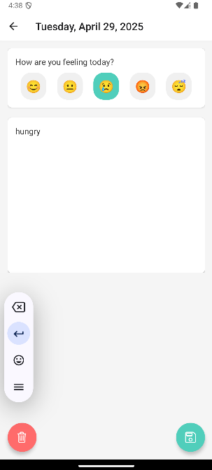

# Mood Diary App

A mobile application for tracking daily moods and emotions.

## Screenshots

### Home Screen

*Monthly calendar view showing mood entries across different days*

### Calendar View

*Daily mood entry screen where users can select their current mood and add notes*

### Analysis Screen

*Monthly mood analysis showing distribution of different moods*

## Features
- Daily mood tracking with emoji selection
- Calendar view of mood history
- Monthly mood analysis and statistics
- Note-taking capability for each entry

## Tools
- React Native 0.71.14
- Expo SDK 48.0.18
- JavaScript (ES6+)
- Android Studio (for emulator and debug)
